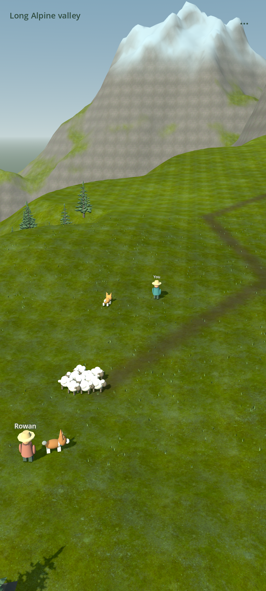
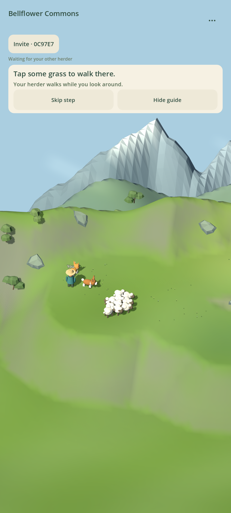
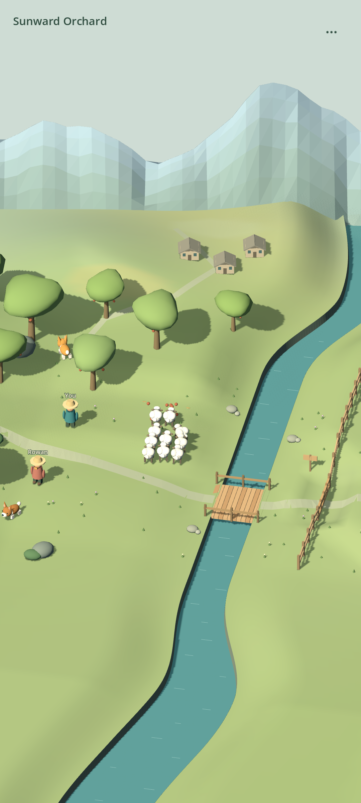
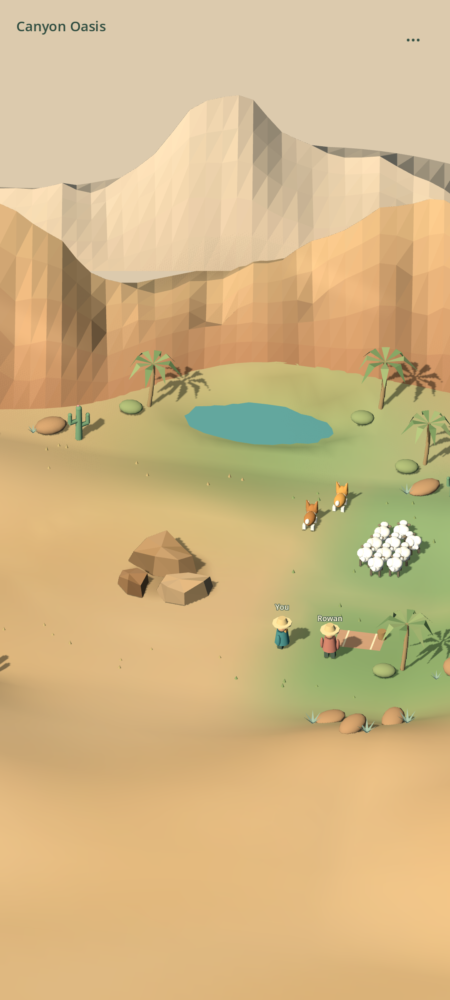
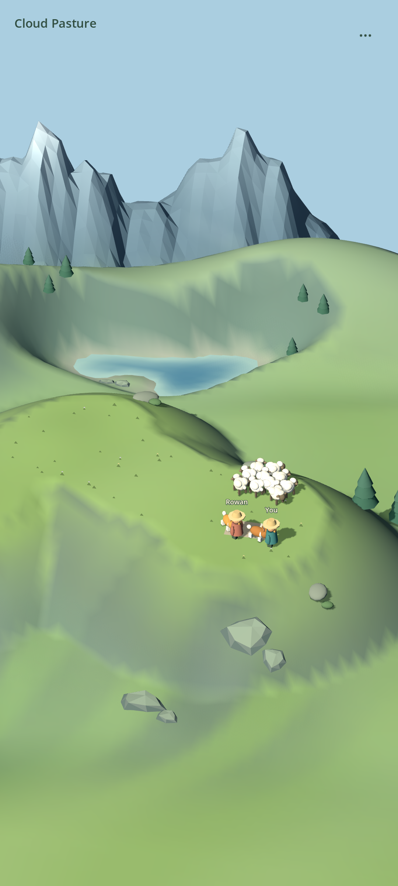
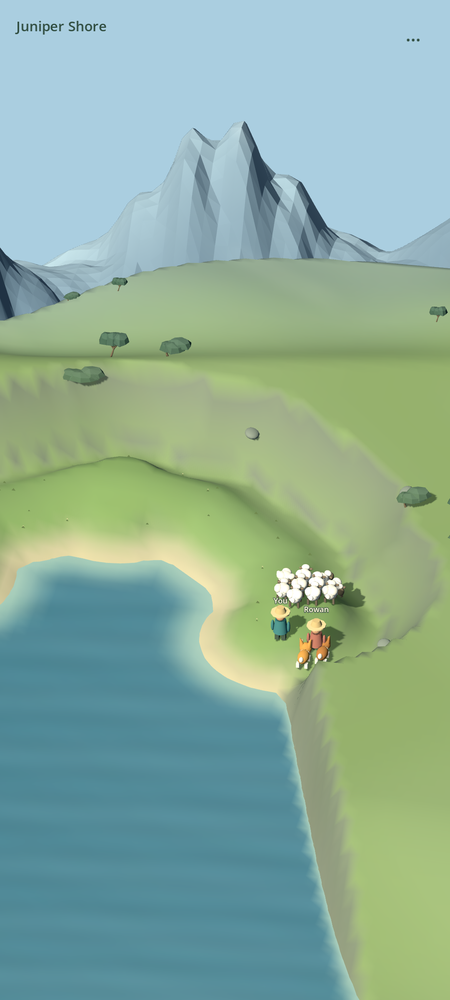

# Corgi Herding

[](https://github.com/Nielk74/corgi-herding/actions/workflows/release.yml)

Two herders. Two corgis. Ten sheep and a shared journey.

A portrait-first cooperative Android game about caring for a flock together, set in an Alpine
valley, a cactus canyon, sheltered Larch Hollow, Sunward Orchard, Canyon Oasis,
Cloud Pasture, Juniper Shore, Bellflower Commons, Long Alpine valley or Wide cactus wash.
An optional Practice meadow guide teaches the controls one step at a time.
Distant mountain ranges and layered
landscapes make the walkable valley feel part of a much larger world. Steep rock,
woods and water mark its natural limits. No combat, score or timer: a wandering
sheep creates another little story.

The terrain itself rises and falls: rolling pastures, terraced banks and rocky
valley sides carry the animals, trails and props at their actual rendered height.
Touch destinations follow that ground rather than an invisible flat plane.
Warm directional light, cooler shadows and subtle contact shading reveal those
slopes. This is mobile raster lighting, not hardware ray tracing.

[Download the latest APK](https://github.com/Nielk74/corgi-herding/releases/latest/download/corgi-herding.apk)
· [All releases](https://github.com/Nielk74/corgi-herding/releases)
· [Design and roadmap](docs/design.md)
· [Run a server](docs/deployment.md)

 

 

 

 



Captured from the signed Android prototype in an emulator connected to the Go
server. Command controls appear only when a corgi is tapped.
See the [temporary corgi command panel](docs/images/contextual-controls.png).

## Play together

1. Install the APK on two Android phones with access to the same game server.
2. One player chooses a landscape, creates a herd and shares its invite code. The other joins the same landscape.
3. Hold the phone upright. Tap the ground to walk; tap either corgi to reveal Come, Stay or Go. You can also press a corgi and drag to some grass to place them directly. The small menu closes after a command.
4. Wander together and guide the flock toward open pasture. In the river valleys, use the bridge and tap the nearby gate to open it. In Canyon Oasis, either dry path around the rock is a way through.
5. Tap your herder to sit, or approach and tap a corgi to pet it. There is no deadline.

Practice meadow is the first choice for a new player without a saved invitation.
Its optional guide explains walking, either shared corgi, commands, sheep pressure
and rest. Skip any lesson, hide the guide, or restart it in settings. Normal
landscapes keep the minimal display; the guide does not appear there.

Long Alpine valley connects sixteen broad clearings and return loops inside
144 × 192 bounds. This is newly walkable ground, not just larger scenery. The
fixed-perspective portrait camera follows your herder and rests when you stop.
There is no finish line or requirement to herd the whole flock in one session.

Wide cactus wash adds fourteen connected clearings across another 144 × 192
region, with branching dry channels, low terraces and distant mesas. Both large
regions now have slowly drifting clouds. The menu's optional **Soft distance**
setting gently softens distant scenery; nearby ground, animals and controls stay
sharp. It starts off and is saved separately from your herd invitation.

In Sunward Orchard, two curious sheep may wander toward fallen apples. Let them
finish their small snack or guide them back with either dog. They remember that
they have eaten, including after reconnecting; no repeated chore or snack meter.

Canyon Oasis opens two dry routes around low weathered stone. There is no gate:
take the flock together, split around the rock, or linger in the green pasture.
Dogs follow the route you choose, and a disconnected herder resumes the same walk.

Cloud Pasture is a broad climbing ridge with three grassy shelves overlooking
an Alpine valley. Wander up, back down, or sit halfway with the dogs. There is no
bridge, gate or arrival prompt. Steep flanks frame the gentle ground without
falls; a split flock can be patiently reunited on the ridge.

Juniper Shore follows a broad dry crescent around an Alpine bay. Three grassy
clearings leave room to gather the flock, turn back or sit beside the lake.
Water and steep shoulders mark the limits; there is no gate or final clearing
to complete. The lake is scenery, not a swimming area.

Short wind breaths and occasional distant bird phrases leave long gaps of quiet.
There is no music loop or sound on every command. Sound stops when opening the
menu, losing the connection or backgrounding the app, then returns with a new
quiet delay after a fresh snapshot. The menu's **Sound** toggle is saved on this
device separately from the herd invitation. The original synthesized sounds are
an early atmosphere pass, not field recordings; phone-speaker listening feedback
is still needed.

The initial server runs on the developer's Mac over LAN. The server address is
editable on the start screen, so self-hosting does not require rebuilding the APK.
The Mac needs to be awake and on the same network. Public internet hosting is
an optional deployment step; this release does not include a rented cloud server.

## Develop

Requires Go 1.26+ and Godot **4.6.3** standard edition.

```sh
cd server
go run ./cmd/server
```

Open `client/project.godot` in Godot. Run two instances, connect both to
`http://127.0.0.1:8790`, and create/join a herd. The Go server simulates on a 2D
plane at 20 Hz; the Godot client renders a fixed 3D view with movement feedback
and entity interpolation. WebSocket JSON messages are documented in
[protocol/README.md](protocol/README.md).

For fast large-map authoring, edit a reviewed JSON recipe and prepare its complete
terrain, grass, props and scenic ring before exporting to Android:

```sh
node tools/build-landscapes.mjs /absolute/path/to/godot
node tools/build-landscapes.mjs --check
```

Unchanged source/asset fingerprints reuse the cache. Both current complete art
recipes cook in roughly two seconds each on the development host; that is build
time, not Android frame time. The cactus dry wash is an authoring variant, not
an additional accepted multiplayer level. See [authoring and critical playtest
notes](docs/playtest-followup.md) and [licensed materials](docs/materials.md).

```sh
cd server
go vet ./...
go test -race ./...
```

```sh
bash tools/run-godot-check.sh godot --headless --path client --editor --quit
bash tools/run-godot-check.sh godot --headless --path client --script res://tests/smoke.gd
bash tools/run-godot-check.sh godot --headless --path client --script res://tests/terrain_smoke.gd
bash tools/run-godot-check.sh godot --headless --path client --script res://tests/static_scenery_batch.gd
bash tools/run-godot-check.sh godot --headless --path client --script res://tests/layout_smoke.gd
bash tools/run-godot-check.sh godot --headless --path client --script res://tests/context_controls_smoke.gd
bash tools/run-godot-check.sh godot --headless --path client --script res://tests/cloud_navigation_smoke.gd
bash tools/run-godot-check.sh godot --headless --path client --script res://tests/shore_smoke.gd
bash tools/run-godot-check.sh godot --headless --path client --script res://tests/shore_boundary_smoke.gd
bash tools/run-godot-check.sh godot --headless --path client --script res://tests/juniper_visual_smoke.gd
bash tools/run-godot-check.sh godot --headless --path client --script res://tests/soundscape_smoke.gd
bash tools/run-godot-check.sh godot --headless --path client --script res://tests/android_ambience_smoke.gd
```

The wrapper also rejects errors printed by Godot with a zero exit status.
CI exercises two connected clients in every landscape, including reconnection.

## Automatic delivery

Each successful `main` push builds and verifies a signed Android APK and macOS /
Linux server binaries, then publishes a GitHub release with SHA-256 checksums.
Version tags starting with `v` and manual workflow runs also produce releases.
Pull requests run verification without access to the signing key.

The installed Mac updater checks the latest completed release every five minutes.
It verifies checksums, retains the previous version, restarts its own server
service, and checks health before accepting an update. Herd checkpoints remain
outside the release directory. See [deployment and rollback](docs/deployment.md).

Repository secrets: `ANDROID_KEYSTORE_BASE64`, `ANDROID_KEYSTORE_PASSWORD`.
The signing alias is `corgi-herding`. Optional repository variable:
`GAME_SERVER_URL` sets the APK's default server. Back up the signing key: changing
it prevents Android from installing future releases as updates.

## Scope

This is milestone 1, not the full journey game. It includes nine landscape choices,
shared dog commands, sheep steering, invitations, reconnection, and file
checkpoints, a small persistent orchard distraction, a two-route rock landscape
an optional practice guide, prepared large-region scenery, and sparse environmental
sound. Puppy adoption/training, richer animations and
animal vocalizations, PostgreSQL,
camp customization and travel between connected regions are subsequent milestones. Two-phone
playtesting is necessary before judging the quality of the animal behavior.

The geometry is original code-generated art, with a [credited CC0 natural
material kit](docs/materials.md). Godot's license is included with
its runtime. The project source is provided for inspection; no open-source
license grant has been selected yet.
