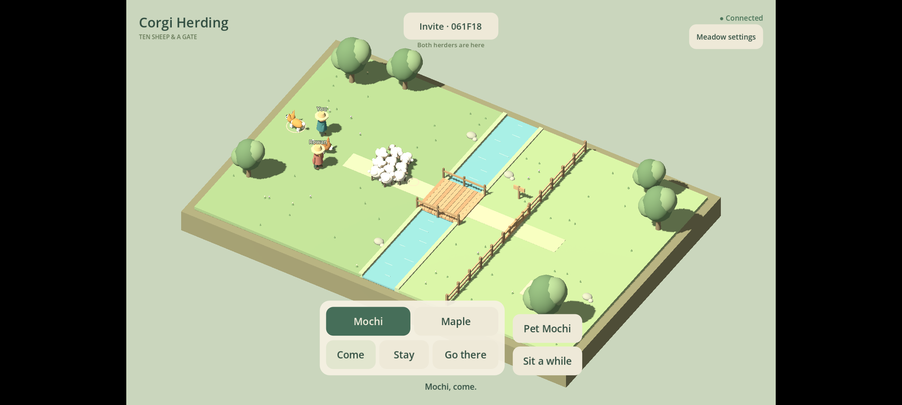
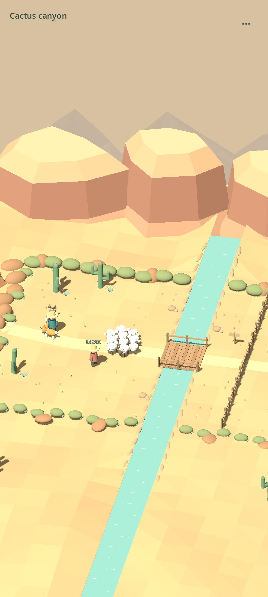
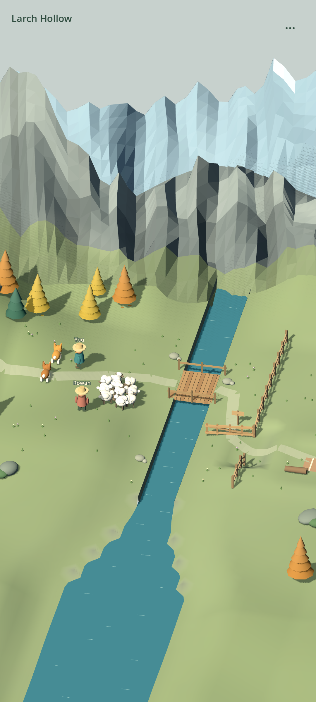

# Corgi Herding

[](https://github.com/Nielk74/corgi-herding/actions/workflows/release.yml)

Two herders. Two corgis. Ten sheep and a gate.

A portrait-first cooperative Android game about caring for a flock together, set in an Alpine
valley, a cactus canyon or sheltered Larch Hollow. Distant mountain ranges and layered
landscapes make the walkable valley feel part of a much larger world. Steep rock,
woods and water mark its natural limits. No combat, score or timer: a wandering
sheep creates another little story.

The terrain itself rises and falls: rolling pastures, terraced banks and rocky
valley sides carry the animals, trails and props at their actual rendered height.
Touch destinations follow that ground rather than an invisible flat plane.
Warm directional light, cooler shadows and subtle contact shading reveal those
slopes. This is mobile raster lighting, not hardware ray tracing.

[Download the latest APK](https://github.com/Nielk74/corgi-herding/releases/latest/download/corgi-herding.apk)
· [All releases](https://github.com/Nielk74/corgi-herding/releases)
· [Design and roadmap](docs/design.md)
· [Run a server](docs/deployment.md)

 



Captured from the signed Android prototype in an emulator connected to the Go
server. Command controls appear only when a corgi is tapped.
See the [temporary corgi command panel](docs/images/contextual-controls.png).

## Play together

1. Install the APK on two Android phones with access to the same game server.
2. One player chooses Alpine valley, Cactus canyon or Larch Hollow, creates a herd and shares its invite code. The other joins the same landscape.
3. Hold the phone upright. Tap the ground to walk; tap either corgi to reveal Come, Stay or Go. The small menu closes after a command.
4. Wander the valley and guide the flock over the bridge. Tap the gate when nearby to open it, then bring the sheep into the pasture.
5. Tap your herder to sit, or approach and tap a corgi to pet it. There is no deadline.

The initial server runs on the developer's Mac over LAN. The server address is
editable on the start screen, so self-hosting does not require rebuilding the APK.
The Mac needs to be awake and on the same network. Public internet hosting is
an optional deployment step; this release does not include a rented cloud server.

## Develop

Requires Go 1.26+ and Godot **4.6.3** standard edition.

```sh
cd server
go run ./cmd/server
```

Open `client/project.godot` in Godot. Run two instances, connect both to
`http://127.0.0.1:8790`, and create/join a herd. The Go server simulates on a 2D
plane at 20 Hz; the Godot client renders a fixed 3D view with movement feedback
and entity interpolation. WebSocket JSON messages are documented in
[protocol/README.md](protocol/README.md).

```sh
cd server
go vet ./...
go test -race ./...
```

```sh
godot --headless --path client --editor --quit
godot --headless --path client --script res://tests/smoke.gd
godot --headless --path client --script res://tests/terrain_smoke.gd
godot --headless --path client --script res://tests/static_scenery_batch.gd
godot --headless --path client --script res://tests/layout_smoke.gd
```

## Automatic delivery

Each successful `main` push builds and verifies a signed Android APK and macOS /
Linux server binaries, then publishes a GitHub release with SHA-256 checksums.
Version tags starting with `v` and manual workflow runs also produce releases.
Pull requests run verification without access to the signing key.

The installed Mac updater checks the latest completed release every five minutes.
It verifies checksums, retains the previous version, restarts its own server
service, and checks health before accepting an update. Herd checkpoints remain
outside the release directory. See [deployment and rollback](docs/deployment.md).

Repository secrets: `ANDROID_KEYSTORE_BASE64`, `ANDROID_KEYSTORE_PASSWORD`.
The signing alias is `corgi-herding`. Optional repository variable:
`GAME_SERVER_URL` sets the APK's default server. Back up the signing key: changing
it prevents Android from installing future releases as updates.

## Scope

This is milestone 1, not the full journey game. It includes three landscape levels,
shared dog commands, sheep steering, invitations, reconnection, and file
checkpoints. Puppy adoption/training, richer animations and sound, PostgreSQL,
camp customization and travel between connected regions are subsequent milestones. Two-phone
playtesting is necessary before judging the quality of the animal behavior.

The art is original code-generated geometry. Godot's license is included with
its runtime. The project source is provided for inspection; no open-source
license grant has been selected yet.
